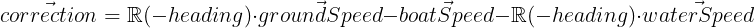
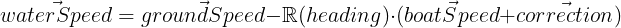

# **Speed Correction & Current Estimation Plugin**  

## **Overview**  
This SignalK plugin estimates **a corrected speed through water**, **leeway**, and **water current** in real-time using advanced filter techniques. The plugin continuously refines its estimates based on vessel speed, heading, ground speed, and heel angle.

### **Key Features**  
- ✅ Real-time correction of vessel speed.  
- ✅ Real time estimation of leeway.
- ✅ Real time estimation of water current (both speed and direction).
- ✅ Adaptive learning: The plugin refines corrections over time.
- ✅ A webApp to give both real time insight in the working of the plugin.
- ✅ Use of Kalman filters to give optimal estimations of paddle.
- ✅ A user configurable 2D correction table for speed errors based on heel and speed.  
  
## **Introduction** 
The plugin is based on the idea that a vessels speed sensor is imperfect and could be corrected. A speed sensor, most often a paddle wheel, is imperfect for two reasons. First, its measurement is not precise. The way that water flows over the hull influences the measurement of the paddle wheel. Second, a paddle wheel does not meaure lateral speed or leeway. Leeway is an important factor for sailing vessels as the wind not only pushes the vessel forward but it also pushes the vessel sideways to lee.

A GPS sensor can also provide information of vessel speed. This is a different kind of speed thatn the paddle wheel provides. The GPS gives the speed over ground where as the paddle wheel gives speed through water. These two are not the same when the the water is flowing. The GPS sensor too has its imperfections.

In theory, one could use the GPS sensor to estimate the error of the paddle wheel. Once this error is known one could correct for it. But to estimate the error of the paddle wheel one would also need to kow the water current. (Speed through water minus current equals ground speed.) As currents cannot be measured directly from a floating vessel and standing water is not always available it is very impractical and time consuming to determine the error or the paddle wheel.

However, given enough measurements one could estimate both current and paddle wheel error. One could sail in two different directions, once with the flow and once against it. The difference in ground speed between both directions must be the current. Itthus can be estimated. Once the current is known one can substract this from the speed through water and compare this to the GPS speed. The difference between these must be the error of the sensors.

The plugin is based on the idea that it is possible to estimate both current and sensor error at the same time. Using these estimations the plugin corrects boat speed, gives an estimation of leeway and estimation of the current. This is all done in real time.

There are however some assumptions that are made for the plugin to work properly:
- The error of the paddle wheel depends on on boat speed and heel angle, otherwise it is constant. It might float very slowly over time though.
- The speed and direction of the current changes slowly and gradually.

## **Configuration of the plugin**
### **1. Correction table** 
The most important parameters for the plugin deal with the correction table. These are step size for heel and speed andmaximum heel and speed.
- The correction table should cover the normal dynamic range of the vessel. Set maximum speed and maximum heel in the correction table to values that the vessel would normally achieve. Do not set it to values that would only occur in exceptional circumstances. If you overdo it you would get table cells that cannot be estimated reliably as there will be insufficient obeservations to base an estimation on. The unreliable values in these cells might stain reliable values in adjectent cells.
- The stepsize of the table should be choosen carefully. Too small step sizes might lead to too little observations for a good estimation. A too big step size might result in imprecise corrections.
- Changing one of the the table dimensions will result in a loss of all existing estimations. 

### **2. Stability and quality of the estimations**
The three stability parameters, one for correction estimation and two for current estimation, indicate how stable the estimations should be. 
- More stable estimations will change more slowly and take longer to adapt to changed circumstances. Less stable estimations will adapt quicker to changed circumstances but will be more vulnarable to corrupt observations or odd situations.
- The stability of the correction table should be 2-3 units larger than that of the current estimation.
- If you are sure that there is no current at all you can tell the plugin. It will increase the quality of the estimations for the correction table. Set the assume no current parameter to true for this. 
- If you start with the correction table its estimations will be not too trustworthy. You can therefore disable the correction of vessel speed. The plugin will still calculate this as it is needed to build up estimations. But a corrected speed will not be outputted as deltas to the SignalK server.
- If you are content with the correction table you can, temporarely, prevent it from being updated further. This can be handy for very dynamic circumstances that might compromise the estimations otherwise.
- my personnal stability settings are 7, 5, 2 when learning, 8, 4, 2 when my correction table has matured.

### **3. plugin output**
You an control what deltas the plugin outputs.
- Corrected speed through water. Outputting this value is controlled by the "Correct boat speed" parameter. 
Forward speed is outputted as navigation.speedThroughWater and leeway is outputted as environment.wind.directionTruenavigation.leewayAngle.
- Current. Outputting this value is controlled by the "Estimate current" parameter.
- Note that even when you do not output corrected boat speed or current that they will be calculated as they are needed in updating the the correction table.

## WebApp
The plugin comes with a WebApp that allows you to view the correction table and to see the estimations in real time. The webApp can be launched from the SignalK server.
The graphical representation of the speed veectors, current vector and correction vector can even be embedded in, for example, your KIP displays. Use the path /speedandcurrent/vectors.html for this.

---

## **How It Works**  

### **1. Speed Correction Model**  
- Vessel speed errors depend on **heel** and **speed**. They are are assumed constant for a given speed and heel angle.
- A correction table is used to store speed errors for steps in speed and heel angle.  
- Each cell in the correction table contains a **Kalman filter** that updates speed corrections every time new speed measurements come available.  
- The speed measurement is the corrected by substracting the correction from the correction table. The correction is **interpolated** based on nearby table cells, weighted by uncertainty of the correction provided by the Kalman filter. 
-  

### **2. Current Estimation Model**  
- The water current is estimated as a **slowly changing** vector. 
- A **Kalman filter** updates the current based on the difference between GPS speed and corrected speed .
- 

---

