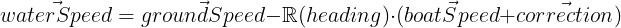

## Correction model
### raw
\vec{correction} = \mathbb{R}(-heading) \cdot \vec{groundSpeed} - \vec{boatSpeed} - \mathbb{R}(-heading) \cdot \vec{waterSpeed}

### link
https://latex.codecogs.com/svg.image?\vec{correction}=\mathbb{R}(-heading)\cdot\vec{groundSpeed}-\vec{boatSpeed}-\mathbb{R}(-heading)\cdot\vec{waterSpeed}

### html

### image

## current model
### raw
\vec{waterSpeed} = \vec{groundSpeed} - \mathbb{R}(heading) \cdot(\vec{boatSpeed}+\vec{correction}) 
### link
https://latex.codecogs.com/svg.image?\vec{waterSpeed}=\vec{groundSpeed}-\mathbb{R}(heading)\cdot(\vec{boatSpeed}&plus;\vec{correction})
### html

### image

